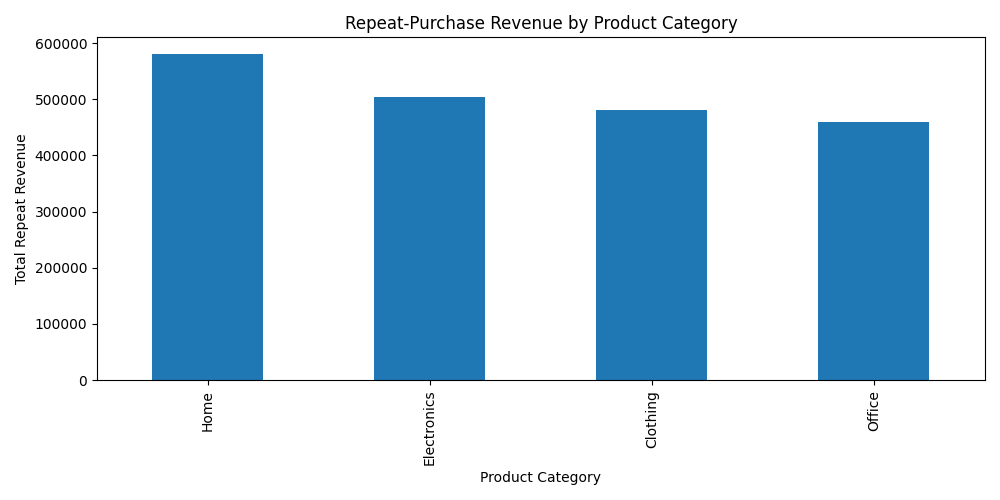
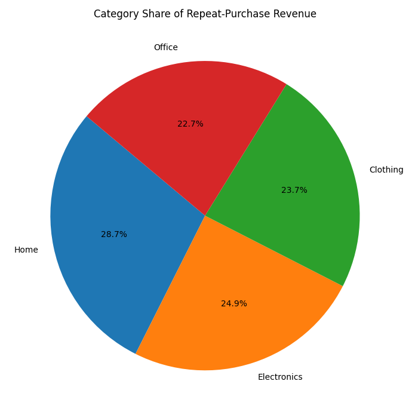
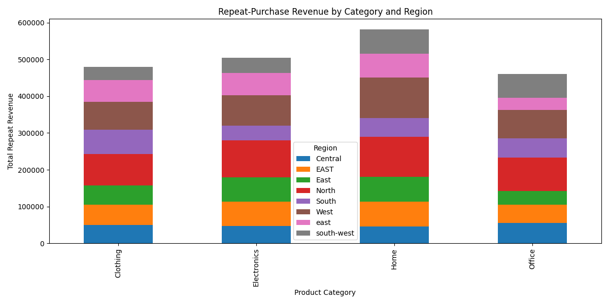
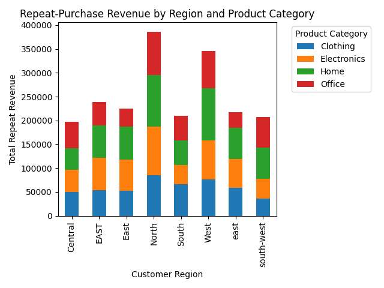
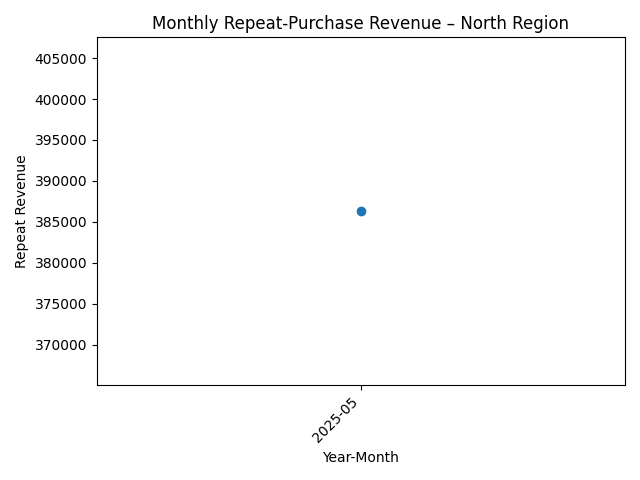

# Smart Store Analytics – Derek Wilkerson

Smart Store Analytics is a professional Python project created for the **Business Intelligence and Analytics** course at Northwest Missouri State University.
It demonstrates how to organize, document, and run analytics code using modern tools such as **uv**, **VS Code**, **Git/GitHub**, and **MkDocs**.

---

## 💡 What This Project Does

- Provides a clean Python project layout under `src/analytics_project/`.
- Includes demo modules for basics, statistics, languages, and visualization.
- Shows how to manage dependencies and environments with **uv** and a local virtual environment.
- Implements a small BI pipeline that:
  - Reads raw CSV files into pandas DataFrames.
  - Cleans and prepares data for ETL.
  - Writes cleaned versions to a prepared data folder.
- Builds project documentation automatically with **MkDocs** and GitHub Pages.

---

## 🛠 How to Set Up

### Clone the repo

From a terminal (PowerShell on Windows):

```bash
git clone https://github.com/wilkersonderek/smart-store-wilkersonderek.git
cd smart-store-wilkersonderek
```

### Create and sync the environment (one-time)

```bash
uv python pin 3.12
uv venv
uv sync --extra dev --extra docs --upgrade
uv run pre-commit install
```

### Activate the virtual environment

**Windows (PowerShell):**

```bash
.\.venv\Scripts\Activate.ps1
```

**macOS / Linux / WSL:**

```bash
source .venv/bin/activate
```

### Verify versions

```bash
python --version
uv --version
```

---

# 🚀 P1: Machine & Project Setup

P1 focused on getting the **local machine** and **project structure** ready for BI work.

### Key Setup Tasks

- Installed and configured Python 3.12, Git, VS Code, and uv.
- Created a new GitHub repo and cloned it locally.
- Initialized a virtual environment (`uv venv`) and synced dependencies (`uv sync`).
- Confirmed all demo modules ran correctly.

---

# 📊 P2: BI Python – Reading Raw Data into pandas DataFrames

## Overview

P2 demonstrated how to use Python and pandas to load raw CSV data files into DataFrames as part of a BI workflow.

### Data Folder Structure

```
data/raw/
│
├── customers_data.csv
├── products_data.csv
└── sales_data.csv
```

### Run the Data Preparation Module

```bash
uv run python -m analytics_project.data_prep
```

This command executes the module directly from the project root.
It reads each raw CSV file found in `data/raw/`, loads it into pandas, and logs the file name and shape.

### Results Summary

| File Name            | Rows | Columns |
|----------------------|------|---------|
| customers_data.csv   | 201  | 6       |
| products_data.csv    | 100  | 4       |
| sales_data.csv       | 2001 | 8       |

---

# 🧹 P3: Prepare Data for ETL

## Objective

P3 focused on **cleaning and preparing data for Extract, Transform, and Load (ETL)**.
The goal is to ensure all datasets are consistent, accurate, and ready for business-intelligence analysis.

### Key Objectives

- Employ pandas to perform common cleaning and prep tasks.
- Wrap this functionality into a reusable `DataScrubber` class.
- Verify behavior with unit tests (optional).
- Use the `DataScrubber` class in the data prep script to process all three tables.

---

## Data Cleaning Process

All reusable cleaning logic was implemented in:

- [`src/analytics_project/data_scrubber.py`](https://github.com/wilkersonderek/smart-store-wilkersonderek/blob/main/src/analytics_project/data_scrubber.py)

The orchestration script that uses this class:

- [`src/analytics_project/data_prep.py`](https://github.com/wilkersonderek/smart-store-wilkersonderek/blob/main/src/analytics_project/data_prep.py)

### Cleaning Actions Performed

| Step | Action | Description |
|------|---------|-------------|
| 1 | **Standardized column names** | Lowercase, underscores, trimmed whitespace |
| 2 | **Trimmed whitespace** | Cleaned up string fields |
| 3 | **Dropped empty rows/columns** | Removed fully blank data |
| 4 | **Removed duplicate records** | Ensured unique entries |
| 5 | **Casted column types** | Converted numeric fields as needed |

### Input → Output Summary

| Input File                    | Clean Output File                         |
|-------------------------------|-------------------------------------------|
| `data/raw/customers_data.csv` | `data/processed/customers_data_clean.csv` |
| `data/raw/products_data.csv`  | `data/processed/products_data_clean.csv`  |
| `data/raw/sales_data.csv`     | `data/processed/sales_data_clean.csv`     |

---

## Commands Used During Cleaning

```bash
# Activate environment
.\.venv\Scripts\Activate.ps1

# Run ETL data prep
uv run python -m analytics_project.data_prep
```

This command loads all raw CSV files, cleans them using the `DataScrubber` class, and exports processed versions into `data/processed/`.

---

## Example Terminal Output

```
Running data prep...
customers_data: cleaned and saved to data/processed/customers_data_clean.csv
products_data: cleaned and saved to data/processed/products_data_clean.csv
sales_data: cleaned and saved to data/processed/sales_data_clean.csv
Data prep complete. Clean files are in data/processed
```

---

## Git Commands Used

```bash
git add README.md src\analytics_project\data_scrubber.py src\analytics_project\data_prep.py
git commit -m "Implement reusable DataScrubber and prepare data for ETL"
git push
```

---

## Notes & Lessons Learned

- Reusable cleaning logic simplifies all future BI workflows.
- Pandas is powerful for automated preprocessing of large data files.
- Documenting commands in the README improves reproducibility.
- Data cleaning can take the most time in BI, so automation is essential.

---

## Final Verification

```bash
dir data\processed
```

Expected output:

```
customers_data_clean.csv
products_data_clean.csv
sales_data_clean.csv
```

---

## Quick Links

- [Repository Home](https://github.com/wilkersonderek/smart-store-wilkersonderek)
- [README.md](https://github.com/wilkersonderek/smart-store-wilkersonderek/blob/main/README.md)
- [DataScrubber Class](https://github.com/wilkersonderek/smart-store-wilkersonderek/blob/main/src/analytics_project/data_scrubber.py)
- [Data Prep Script](https://github.com/wilkersonderek/smart-store-wilkersonderek/blob/main/src/analytics_project/data_prep.py)
- [Processed Data Folder](https://github.com/wilkersonderek/smart-store-wilkersonderek/tree/main/data/processed)

---

### ✅ Commit & Push Commands

🏛️ P4: Data Warehouse Design and ETL to the Data Warehouse

Overview
In P4, I expanded the Smart Store BI pipeline by building a small analytical data warehouse in SQLite. The goal was to transition from cleaned CSV files into a dimensional model that supports flexible, fast business-intelligence queries.

This phase focused on designing a simple star schema, creating the SQLite database, and building a Python ETL script that loads the dimension and fact tables from the processed data. After running the pipeline, I verified that the warehouse contained the expected number of rows and was ready for reporting.

Data Warehouse Files
• SQLite database: data/dw/smart_sales.db
• ETL script: src/analytics_project/etl_to_dw.py
• Cleaned source data:
– data/processed/customers_data_clean.csv
– data/processed/products_data_clean.csv
– data/processed/sales_data_clean.csv

Star Schema Design
The warehouse follows a star schema with a central fact table and two supporting dimensions:

dim_customer ← fact_sales → dim_product

Key concepts used:
• dim_customer contains descriptive details about each customer
• dim_product contains product attributes
• fact_sales stores numeric measures (quantity, sale amount) and foreign keys to each dimension

This structure supports OLAP-style questions such as “Which customers are driving sales?” or “What product categories generate the most revenue?”

ETL Process
The ETL script performs the full extract–transform–load workflow:

Reads the cleaned CSV files from the processed data folder

Creates the SQLite database if it does not already exist

Builds the dimension and fact tables

Loads customers, products, and sales transactions into their respective tables

Logs row counts to confirm successful loading

After running the ETL, I confirmed that each dimension table and the fact table contained the expected number of rows. This completed the transition from flat files to a structured analytical warehouse.

📊 P5: Cross-Platform Reporting with Power BI and Spark

Overview
P5 focused on connecting the SQLite data warehouse from P4 to Power BI using an ODBC DSN. This step demonstrated how the star schema enables flexible analysis across tools such as Power BI, Spark, and potentially other BI platforms.

The goal was to build visuals using DAX measures and confirm that the warehouse design supports common business-intelligence workflows without additional restructuring.

Task 1 – Install and Configure Power BI + SQLite ODBC
I installed Power BI Desktop, configured the SQLite ODBC driver, and created a DSN (SmartSalesDSN) that points to data/dw/smart_sales.db.
This allowed Power BI to read the warehouse just like any other relational data source.

Task 2 – Load Warehouse Tables into Power BI
After selecting the ODBC DSN, I loaded dim_customer, dim_product, and fact_sales into Power BI.
In Model view, I confirmed the expected relationships:
• dim_customer.CustomerID → fact_sales.CustomerID
• dim_product.ProductID → fact_sales.ProductID

This recreated the star schema visually inside Power BI.

Task 3 – Measures and Visuals
I created several DAX measures to support analysis, including:
• Total Sales Amount
• Total Quantity Sold
• Average Order Value

Using these measures, I built examples such as:
• A bar chart showing total sales by product category
• A table highlighting the top customers by spending
• Slicers to filter data by date, product category, or customer attributes

These visuals confirmed that the warehouse structure supports fast, meaningful OLAP queries.

Task 4 – Example Insights
From the Power BI report, I observed that:
• A few product categories generate most of the revenue
• A small group of customers accounts for a large share of sales
• Slicers make comparisons across time periods or categories straightforward

These insights highlight the value of having a clean dimensional model.

Cross-Platform Use (Spark and Others)
Because the warehouse uses a SQLite file and a star schema, it can be easily reused in Spark, Tableau, Excel, Jupyter notebooks, or other tools. P4 provided the warehouse foundation, and P5 demonstrated its flexibility in a professional BI environment.

Reflection
This phase helped me connect a real data warehouse to Power BI and build visually driven analysis with DAX measures. I gained experience validating schema relationships, defining metrics, and using visuals to answer typical BI questions. The star schema design also demonstrated how one well-structured warehouse can support multiple reporting platforms without rebuilding the pipeline.


# P6: BI Insights and Storytelling – Engage (With One Outcome)

This section documents the work completed for **P6: BI Insights and Storytelling**, where the focus shifts from technical data preparation and warehousing to **communicating insights** in a clear, compelling, and decision-oriented format. The goal is to demonstrate the ability to analyze prepared data, design meaningful visualizations, and connect insights to a tangible business outcome.

---

## 🎯 Purpose of P6

The purpose of this module is to practice the essential skill of turning data into *actionable business intelligence*. A dashboard or visualization is only useful if it drives understanding and leads to action. This project focuses on:

- Interpreting trends and patterns in the Smart Store dataset
- Designing BI visuals that answer real business questions
- Applying best practices in storytelling, clarity, and simplicity
- Connecting every insight to **one specific business outcome**

---

## 📈 Tools Used

For this phase, the following tools were used:

- **Power BI** – For designing dashboards and visual stories
- **SQLite Data Warehouse** – As the trusted data source generated in earlier modules
- **Python (optional)** – Used for any supplemental analysis if needed

---

## 🧠 Selected Business Outcome

**Outcome:** *Increase total store revenue by identifying top-performing product categories and recommending inventory adjustments to maximize profitability.*

This outcome was chosen because the Smart Store dataset clearly lends itself to uncovering sales distribution patterns, category performance, and opportunities to shift inventory toward high-value segments.

---

## 📊 Key Insights Developed

The following OLAP visuals were created to support the selected business outcome.

### 1. Sales by Product Category

To understand which categories drive the most revenue, a category-level analysis was performed.

**Visuals:**





**Insight:**
These visuals show which product categories contribute the highest share of total revenue and which underperform. This helps prioritize which categories should receive more shelf space, inventory, or promotion.

---

### 2. Revenue by Region and Category

Next, revenue was analyzed by **region and category** to see whether performance patterns were consistent across locations.

**Visuals:**





**Insight:**
The stacked chart highlights how each category performs in different regions, while the repeat-revenue view shows where loyal customers are concentrated. Together, they reveal where to focus regional marketing and inventory strategies.

---

### 3. Monthly Repeat Trend – North Region

To understand customer loyalty and repeat purchasing behavior over time, repeat revenue was examined by month in one region.

**Visual:**



**Insight:**
This trend line shows whether repeat revenue in the North region is increasing, flat, or declining. It supports decisions around retention campaigns, loyalty programs, and targeted promotions.

---

## 🪄 Storytelling Structure Used

To maintain clarity and flow, the narrative followed this structure:

1. **Setup (Context):** What business question is being answered?
2. **Insight (Finding):** What does the data show?
3. **Implication (Meaning):** Why does it matter?
4. **Action (Outcome):** What should the business do next?

This structure ensures that visuals are not just charts but *drivers of decision-making*.

---

## 📘 Final Deliverables

The final P6 submission included:

- A Power BI report containing:
  - 3–5 visuals supporting one clear business outcome
  - Clean layout with deliberate use of color, whitespace, and labels
  - Consistent formatting following BI design guidelines
- A written or narrated insight summary explaining the recommended action and how each OLAP visual supports the decision

---

## ✅ Summary

P6 demonstrates the transition from *data engineering* to *data communication*. The OLAP visuals above tie directly to a single business outcome: improving revenue through category and regional optimization. This project completes the BI pipeline and showcases the full analytics lifecycle—from raw data all the way to actionable business intelligence.
